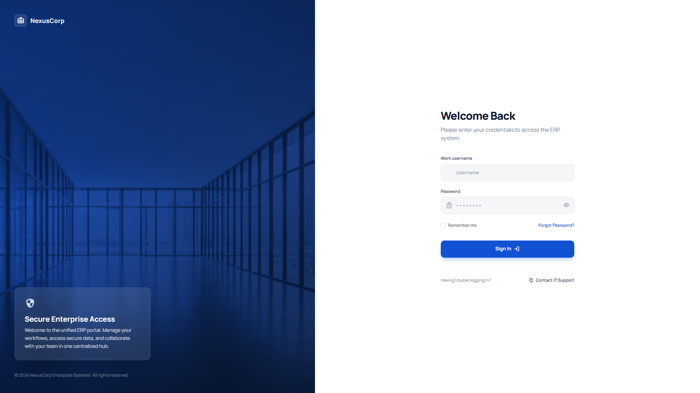
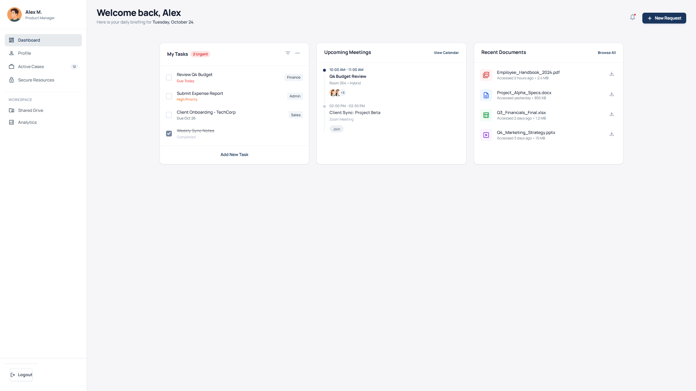
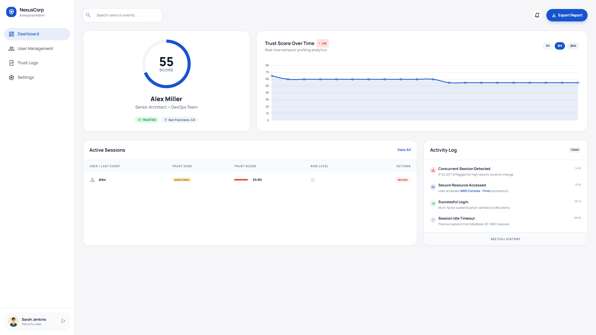
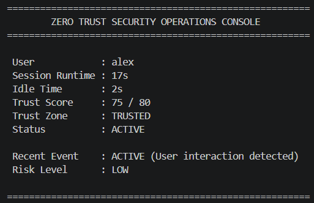

# Zero Trust Security Model using Adaptive Trust Evaluation Engine

A Flask-based Zero Trust Security simulation that continuously evaluates user trust based on behavioral patterns, session activity, resource access, and contextual risk factors. The system dynamically adjusts trust levels, classifies user risk, and enforces adaptive access control to demonstrate Zero Trust Architecture (ZTA) principles in an enterprise environment.

## Live Demo

🔗 https://zero-trust-security-model.onrender.com

---

## Features

* Enterprise-style User Authentication Portal
* Dynamic Trust Score Calculation Engine
* Real-Time Behavioral Monitoring
* Continuous Session Verification
* Sensitive Resource Access Tracking
* Risk-Based User Classification
* Administrative Security Operations Dashboard
* Automatic Session Revocation for Low-Trust Users
* Live Trust Score Analytics and Monitoring

---

## Tech Stack

* Python
* Flask
* HTML
* CSS
* Jinja2 Templates

---

## Project Structure

```text
zero-trust-demo/
│
├── app.py
├── trust_engine.py
│
├── screenshots/
│   ├── login.png
│   ├── user-dashboard.png
│   ├── admin-dashboard.png
│   └── trust-console.png
│
└── templates/
    ├── login.html
    ├── dashboard.html
    └── admin.html
```

---

## Running the Project

```bash
pip install flask
python app.py
```

Open your browser and visit:

```text
http://localhost:5000
```

---

## Demo Credentials

### Standard User Access

| Role          | Username | Password |
| ------------- | -------- | -------- |
| Employee/User | alex     | 1234     |

### Administrator Access

| Role          | Username | Password |
| ------------- | -------- | -------- |
| Administrator | admin    | admin123 |

> These credentials are intended for demonstration purposes and showcase the Zero Trust authentication and trust evaluation workflow.

---

## Security Concepts Demonstrated

* Zero Trust Architecture (ZTA)
* Continuous Verification
* Adaptive Access Control
* Dynamic Risk Assessment
* Least Privilege Principles
* Session Monitoring and Validation
* Behavioral Analytics
* Trust-Based Decision Making

---

## Screenshots

### Login Portal



### User Dashboard



### Admin Dashboard



### Security Operations Console



---

## Future Enhancements

* Multi-Factor Authentication (MFA)
* SIEM Integration
* User and Entity Behavior Analytics (UEBA)
* Risk-Based Access Policies
* Audit Logging and Reporting
* Cloud-Based Deployment

---

## Author

**Ashish Betal**
B.Tech CSE (Cyber Security)
CVR College of Engineering
